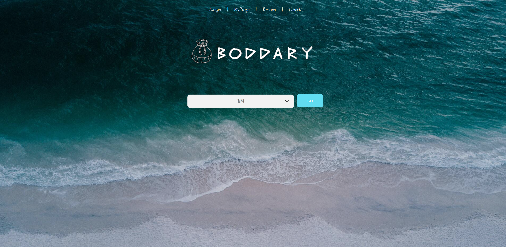
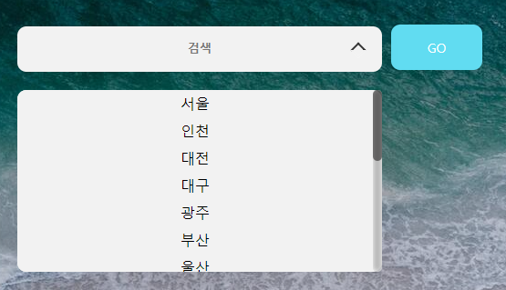
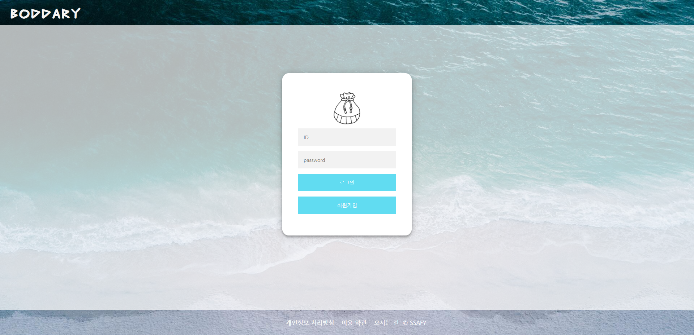
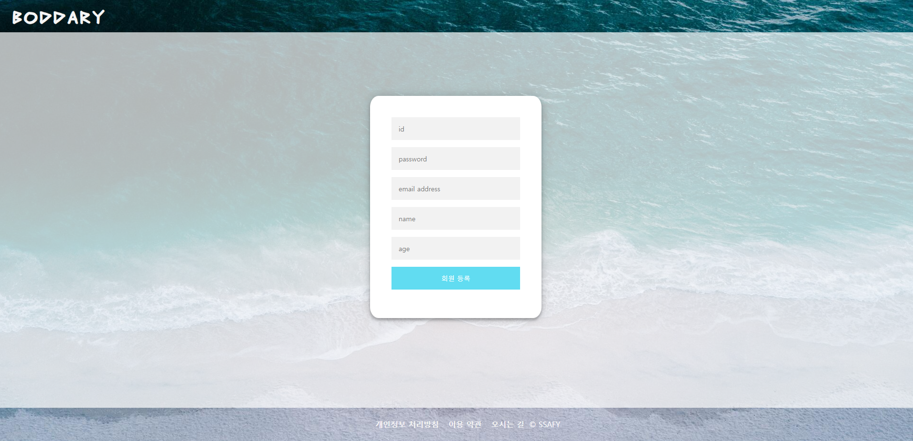
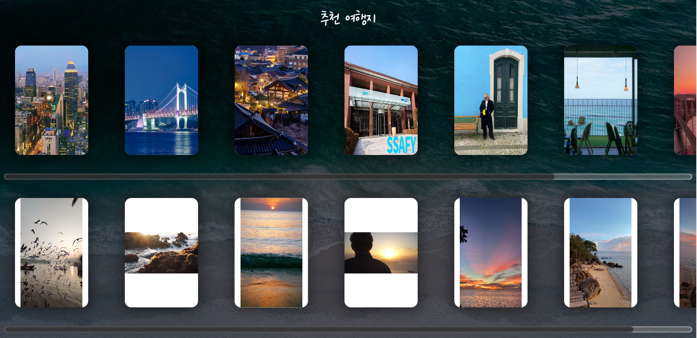
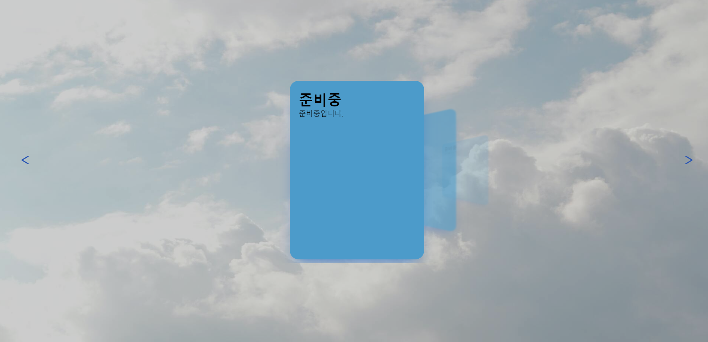
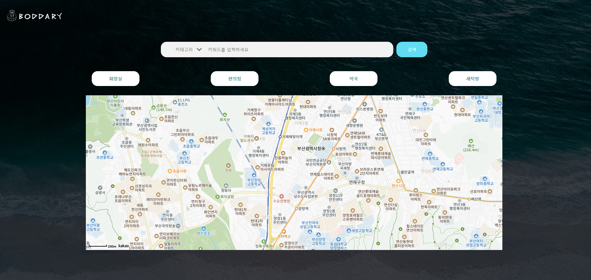
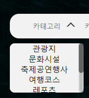
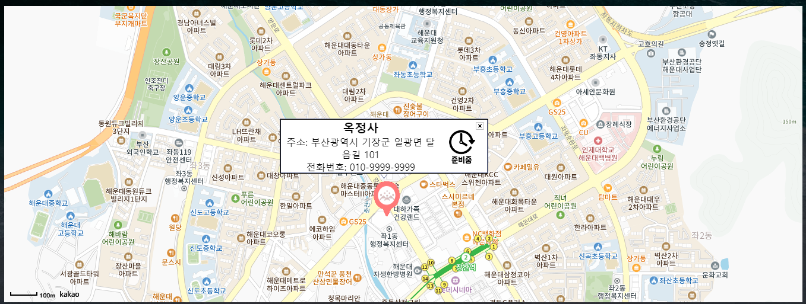
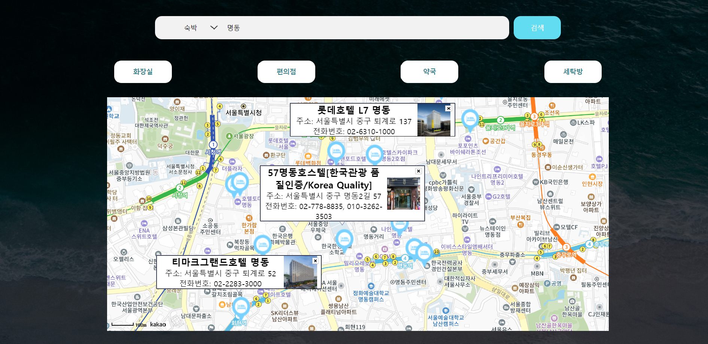

### 프로젝트 개요

- 여행을 좋아하는 사람들을 위한 여행지 및 편의시설 조회 서비스

```java
기본 기능
    메인 페이지 및 메뉴 구성 - (O)
	관광지 정보 조회 - (O)
	회원 관리 페이지(등록, 수정, 삭제, 조회) - (O)
	로그인 / 로그아웃 - (O)

추가 기능
    사이트맵 / 전체적인 메뉴 구성 화면 - (X)
    나만의 여행계획 페이지(팀별 아이디어) - (X)

심화 기능
    HotPlace 관련 페이지(팀별 아이디어) - (X)
    게시판 페이지(등록, 수정, 조회, 삭제) - (X)
```

### 화면 구성

- 메인화면
  - 지역 정보 선택
  - 인기 게시물(준비중)
  - 여행지 추천(준비중)
- 로그인
- 회원가입
- 지역별 여행지 조회
  - 카테고리별 여행지 조회
  - 근처 편의시설 조회(준비중)

---

### 1️⃣ 메인화면

📑 : 지역 정보 선택,인기 게시물,여행지 추천<br>

- ### 지역 정보 선택

  - 드롭바 메뉴 : 드롭바의 지역 선택 후 Go클릭시 지도조회로 이동
    
    
    <br><br>

  - 상단바 메뉴 : 로그인과 회원가입,인기 게시물,여행지 추천으로 이동 <br><br>
    
    
    <br><br>

- ### 인기 게시물

  - 상단 : 인기있는 사진 목록표시
  - 하단 : 인기있는 쇼츠 목록표시(마우스 호버시 자동 재생)
    

<br><br>

- ### 여행지 추천

  - 카드 : 성향에 맞는 사진을 모두 선택 후 여행지 추천
    
    <br><br>

---

### 2️⃣ 지도 조회

- 드롭바 메뉴 : 카테고리 선택 후 해당되는 여행지 정보를 지도에 표시
  
  
  
  <br>
- 검색 기능 : 검색 키워드가 있을 시 검색 키워드가 포함되는 정보만 표시
  
  <br><br>

---
